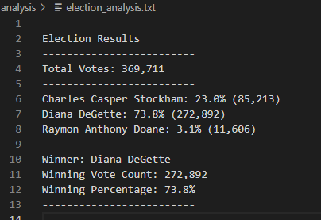

# **Election_Analysis**

## **project Overview**
-Board of elections has requested to conduct an election audit 
## **Resources**
-Data source: election_results.csv
-software: Python 3.7.6

## **Summary**
-There were 369,711 total votes
-There were Three Candidates:
1. Charles Stockham
2. Diana Degette
3. Raymon Doane

-The Candiate results were:
- Charles Casper Stockham: 23.0% (85,213)
- Diana DeGette: 73.8% (272,892)
- Raymon Anthony Doane: 3.1% (11,606)

-The winner was:
- Diana DeGette
- Winning Vote Count: 272,892
- Winning Percentage: 73.8%

## **Challenge Overview**
### **Deliverable 1**
 
## **Challenge Summary**
