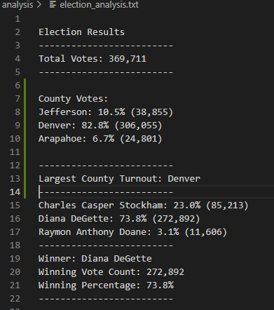
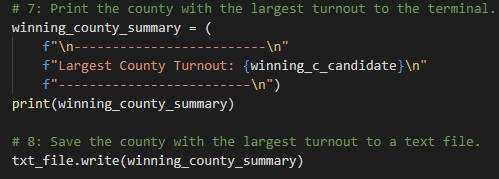
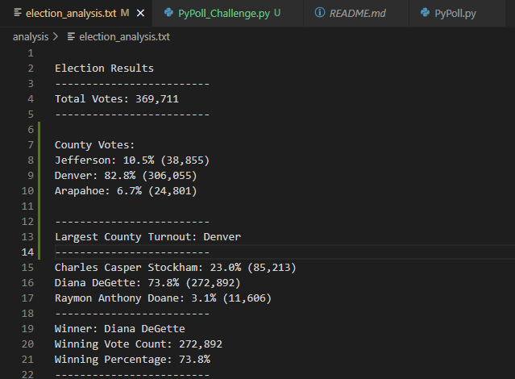

# **Election_Analysis**

## **project Overview**
-Board of elections has requested to conduct an election audit 
## **Resources**
-Data source: election_results.csv
-software: Python 3.7.6

## **Summary**
-There were 369,711 total votes
-There were Three Candidates:
1. Charles Stockham
2. Diana Degette
3. Raymon Doane

-The Candiate results were:
- Charles Casper Stockham: 23.0% (85,213)
- Diana DeGette: 73.8% (272,892)
- Raymon Anthony Doane: 3.1% (11,606)

-The winner was:
- Diana DeGette
- Winning Vote Count: 272,892
- Winning Percentage: 73.8%

## **Challenge Overview**
###**Overview of Election Audit**
the Purpose of this analysis is to determine the total number of votes , the results per each candidate and the winners details.
### **Deliverable 1**

#### **Deliverable Requirements**
1. Total Votes in the election are printed to the terminal.
2. Each candidate’s total votes and percentage of votes are printed to the terminal
3. The winner of the election, winning vote count, and winning percentage of votes are printed to the terminal.
4. Each county and its total vote count are printed to the terminal.
5. Each county and its percentage of the total votes are printed to the terminal.
6. The county with the largest number of voters is printed to the terminal.

### **Deliverable 2**

#### **Deliverable 2 Requirments**
1. Total Votes in the election are saved in the election_results.txt file.
2. Each candidate’s total votes and percentage of votes are saved in the election_results.txt file.
3. The winner of the election, winning vote count, and winning percentage of votes are saved in the election_results.txt file. 
4. Each county and its total vote count are saved in the election_results.txt file.
5. Each county and its percentage of the total votes are saved in the election_results.txt file.
6. The county with the largest number of voters is saved in the election_results.txt file. 

## **Challenge Summary**
### **Election-audit results**

- **Total Votes**= 369,711
- **County Vote**:
  -Jefferson: 38,855
  -Denver: 306,055
  -Arapahoe: 24,801
 - **Largest County turnout**: Denver
 - **Winner**: Diana DeGette
 - **Winning Vote count**: 272,892
 - **winning Percentage**: 73.8% 

### Election-audit Summary
this script can be used with some modifications for annual corporate meeting to calculate each vote depending on the weight ( number of shares ) each voters has. another way to use this script with some modification is to calculate how is the participation for each county in adiminsitring the COVID Vaccine within a particular state.
